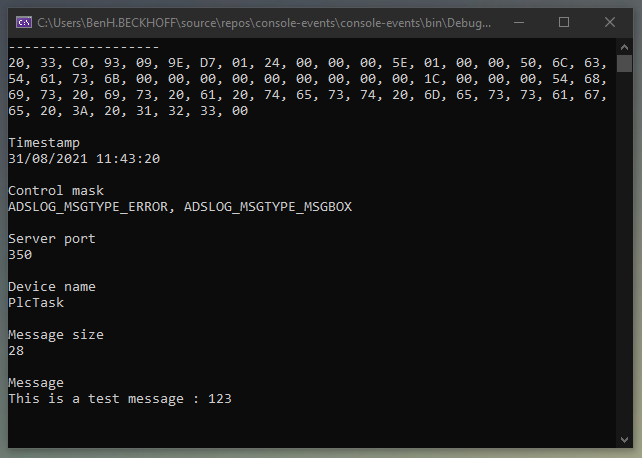

# Example Capturing TC3 Log Messages

## Disclaimer

This is a personal guide not a peer reviewed journal or a sponsored publication. We make
no representations as to accuracy, completeness, correctness, suitability, or validity of any
information and will not be liable for any errors, omissions, or delays in this information or any
losses injuries, or damages arising from its display or use. All information is provided on an as
is basis. It is the reader’s responsibility to verify their own facts.

The views and opinions expressed in this guide are those of the authors and do not
necessarily reflect the official policy or position of any other agency, organization, employer or
company. Assumptions made in the analysis are not reflective of the position of any entity
other than the author(s) and, since we are critically thinking human beings, these views are
always subject to change, revision, and rethinking at any time. Please do not hold us to them
in perpetuity.

## Overview 

Simple demo showing how to retreive the data contained in ADSLOGSTR, and any other mechanism which uses ADS Log.

```c
typedef struct
{
    __int64 nTimeStamp;
    DWORD dwMsgCtrl;
    ULONG nServerPort;
    char sDeviceName[ADS_FIXEDNAMESIZE];
    ULONG cbMsgSize;
    char szMsg[ANYSIZE_ARRAY];
} AdsLogNotification, *PAdsLogNotification;
```

### Example output



### Based on the TwinCAT project


## Versions
* TcXaeShell 3.1.4024.17
* Visual Studio 2019

## Getting started

Open and run the demo-event-runner Twincat project on your local machine. 
Open and start the console-events .net application on your local machine. 

Set the trigger bit in Main to True to trigger a log. 

This is not a guide for TcXaeShell, please visit http://beckhoff.com/ for further guides
* Open the included TwinCAT project and activate on your local machine
* Login and set the PLC running
* Open the HMI in live view

